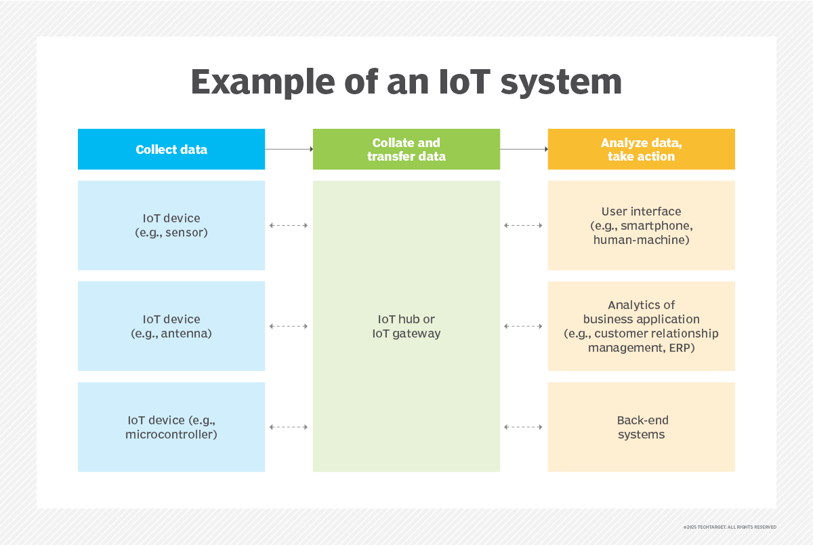

# Einleitung
\textauthor{Chloe Pripfl}

Die Bezeichnung IoT oder "Internet of Things" beschreibt ein Netzwerk verbunder Geräte. Welche mithilfe von beispielsweise Sensoren, Daten erhalten und diese miteinander Teilen. Was zu einer Effizienssteigerung führt und einem Automatisierungsmöglichkeiten bietet.[@WhatIsIoT].

 
Abbildung \ref{fig:IoT-System-Example} [@WhatIsIoT] ist ein Beispiel für ein IoT System.

In der Industrie ist IoT, dort oft als IIot, sprich "Industrial Internet of Things", bereits weit als Teil der Industrie 4.0 verbreitet [@IIoT]. Die Verschiedenen Use-Cases welche man mit IIoT angehen kann kann man hier nachlesen [@IoTUseCase]. 

Auch in der Heimautomatisierung ist IoT bereits ein Hauptbestandteil. Es erlaubt einem Heizung, Sicherheitsysteme, Belichtung usw. mit einem Endgerät aus zu Steuern. Jedoch ist die Interoperabilität vieler Geräte dieser Branche immer noch weiterhin ein Problem für nicht technisch versierte Menschen [@IoTHomeAutomation].

Im Zuge der Diplomarbeit [HIER TITEL] wird ein "IoT-Car" simuliert um Verschiedene IoT-Aspekte zu betrachten und als Praxisbeispiel darzustellen. Im Fokus steht dabei die Anbindung und Auswertung von Sensoren sowie die Kommunikation und Steuerung mit einen externen Endgerät.
