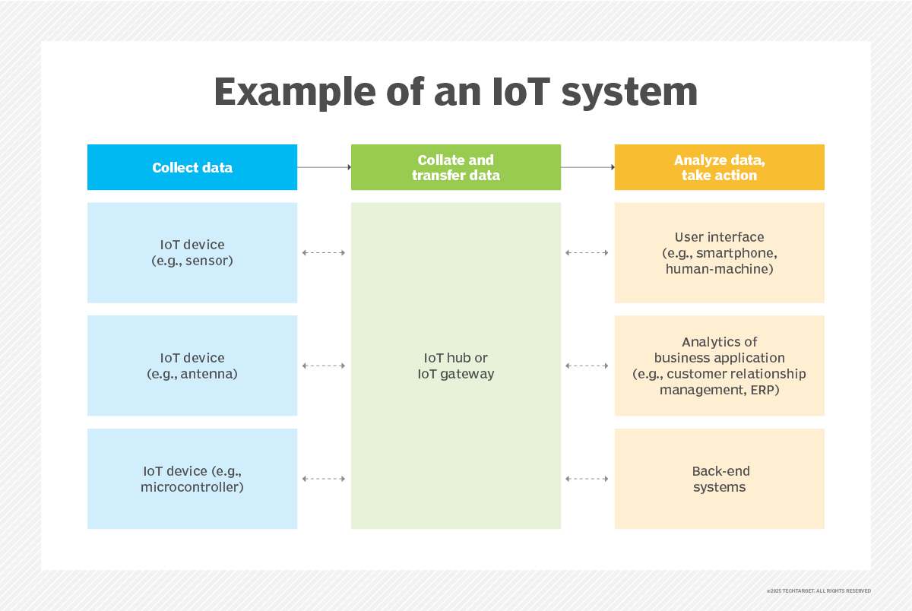

# Einleitung
\textauthor{Chloe Pripfl}

Das Internet of Things (IoT) beschreibt die Vernetzung physischer oder virtueller Geräte, die mithilfe von Sensoren Daten erfassen, austauschen und verarbeiten können. Dadurch lassen sich Abläufe automatisieren und Informationen zwischen unterschiedlichen Systemen bereitstellen. [@WhatIsIoT]

Abbildung \ref{fig:IoT-System-Example} zeigt beispielhaft den grundlegenden Aufbau eines IoT-Systems. [@WhatIsIoT]

Auch in der Industrie spielt IoT eine wichtige Rolle. In diesem Zusammenhang wird häufig vom Industrial Internet of Things (IIoT) gesprochen. Dabei werden Maschinen, Sensoren und Softwaresysteme miteinander vernetzt, um Betriebsdaten zu erfassen, Prozesse zu überwachen und Automatisierung zu ermöglichen. [@IIoT]

Die möglichen Anwendungsbereiche sind vielfältig und reichen von der Zustandsüberwachung über vernetzte Produktionsanlagen bis hin zu intelligenten Steuerungs- und Überwachungssystemen. [@IoTUseCase]

Auch im privaten Umfeld ist IoT weit verbreitet. Beispiele dafür sind vernetzte Heizungen, Beleuchtungssysteme, Sicherheitslösungen oder andere Smart-Home-Komponenten, die über ein Smartphone oder ein anderes Endgerät gesteuert werden können. [@IoTHomeAutomation]

Im Rahmen dieser Diplomarbeit wird ein IoT-Car als praktisches Beispiel für ein vernetztes System betrachtet. Ursprünglich war vorgesehen, ein bereits vorhandenes physisches IoT-Car direkt weiterzuentwickeln. Da während des für die praktische Umsetzung notwendigen Zeitraums kein durchgehender Zugriff auf das Fahrzeug möglich war, wurde die Umsetzung auf eine digitale Simulation verlagert.

Das Fahrzeug wird in Gazebo Sim als virtuelles Modell nachgebildet. ROS 2 übernimmt dabei die Kommunikation zwischen den einzelnen Komponenten. Neben der Fahrzeugsteuerung werden auch eine Frontkamera, ein Abstandssensor und eine Geschwindigkeitsauswertung integriert.

Zusätzlich wird eine webbasierte Benutzeroberfläche entwickelt, über die das simulierte Fahrzeug von einem Desktop-PC oder Smartphone gesteuert werden kann. Gleichzeitig werden Kamerabild und Telemetriedaten angezeigt.

Ziel ist es, die grundlegenden Prinzipien eines vernetzten IoT-Systems anhand einer funktionsfähigen und reproduzierbaren Simulation praktisch darzustellen. Dabei stehen insbesondere die Kommunikation zwischen mehreren Softwarekomponenten, die Verarbeitung von Sensorwerten sowie die Steuerung über ein externes Endgerät im Mittelpunkt.
